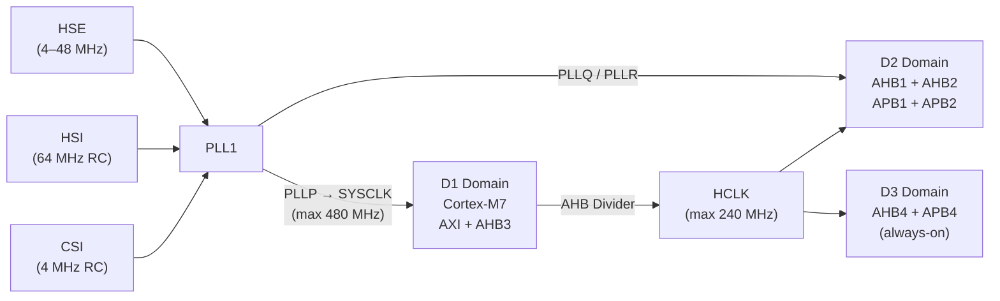

The HAL RCC (Reset and Clock Control) driver configures every clock source and bus divider on STM32H7 devices. Unlike simpler STM32 families, STM32H7 uses a three-domain architecture (D1, D2, D3) each with its own AHB/APB prescalers and independent clock-gating, which gives fine-grained control over power and performance across the Cortex-M7, Cortex-M4 (dual-core variants), and always-on low-power D3 peripherals.

## STM32H7 clock tree overview



<Note>
  STM32H743/H753 supports up to 480 MHz SYSCLK (VOS0) or 400 MHz (VOS1). STM32H7A3/H7B3 uses a different PLL topology; always consult the device-specific reference manual for maximum frequencies and voltage-scaling requirements.
</Note>

## RCC_OscInitTypeDef

Passed to `HAL_RCC_OscConfig` to enable and configure oscillators and PLLs.

<ParamField path="OscillatorType" type="uint32_t" required>
  Bitmask of oscillators to configure. Combine with `|`.

  | Value | Oscillator |
  |---|---|
  | `RCC_OSCILLATORTYPE_HSE` | High-speed external (crystal or clock input) |
  | `RCC_OSCILLATORTYPE_HSI` | High-speed internal RC (64 MHz) |
  | `RCC_OSCILLATORTYPE_CSI` | Low-power internal RC (4 MHz, required for I/O compensation cell) |
  | `RCC_OSCILLATORTYPE_LSE` | Low-speed external 32.768 kHz crystal |
  | `RCC_OSCILLATORTYPE_LSI` | Low-speed internal RC (~32 kHz) |
</ParamField>

<ParamField path="HSEState" type="uint32_t">
  `RCC_HSE_OFF`, `RCC_HSE_ON` (crystal), or `RCC_HSE_BYPASS` (external clock signal on OSC_IN).
</ParamField>

<ParamField path="HSIState" type="uint32_t">
  `RCC_HSI_OFF` or `RCC_HSI_ON`.
</ParamField>

<ParamField path="CSIState" type="uint32_t">
  `RCC_CSI_OFF` or `RCC_CSI_ON`. The CSI oscillator must be enabled when using the I/O compensation cell.
</ParamField>

<ParamField path="PLL.PLLState" type="uint32_t">
  `RCC_PLL_NONE` (leave as-is), `RCC_PLL_OFF`, or `RCC_PLL_ON`.
</ParamField>

<ParamField path="PLL.PLLSource" type="uint32_t">
  PLL input clock: `RCC_PLLSOURCE_HSI`, `RCC_PLLSOURCE_CSI`, or `RCC_PLLSOURCE_HSE`.
</ParamField>

<ParamField path="PLL.PLLM" type="uint32_t">
  Input divider (1–63). Sets PLL input frequency: `f_in / PLLM` must be in the VCO input range selected by `PLLRGE`.
</ParamField>

<ParamField path="PLL.PLLN" type="uint32_t">
  VCO multiplier (4–512 for wide VCO, 8–420 for medium VCO). VCO output = `(f_in / PLLM) × PLLN`.
</ParamField>

<ParamField path="PLL.PLLP" type="uint32_t">
  PLLP output divider (2–128, even values). Drives SYSCLK in most configurations.
</ParamField>

<ParamField path="PLL.PLLQ" type="uint32_t">
  PLLQ output divider (1–128). Commonly used for USB, RNG, SDMMC, and SPI kernel clocks.
</ParamField>

<ParamField path="PLL.PLLR" type="uint32_t">
  PLLR output divider (1–128). General-purpose peripheral kernel clock.
</ParamField>

<ParamField path="PLL.PLLVCOSEL" type="uint32_t">
  VCO frequency range: `RCC_PLL1VCOWIDE` (192–836 MHz) or `RCC_PLL1VCOMEDIUM` (150–420 MHz).
</ParamField>

<ParamField path="PLL.PLLRGE" type="uint32_t">
  PLL input frequency range after the M divider.

  | Value | Range |
  |---|---|
  | `RCC_PLL1VCIRANGE_0` | 1–2 MHz |
  | `RCC_PLL1VCIRANGE_1` | 2–4 MHz |
  | `RCC_PLL1VCIRANGE_2` | 4–8 MHz |
  | `RCC_PLL1VCIRANGE_3` | 8–16 MHz |
</ParamField>

<ParamField path="PLL.PLLFRACN" type="uint32_t">
  Fractional PLL multiplier (0–8191). Set to 0 for integer-N operation.
</ParamField>

## RCC_ClkInitTypeDef

Passed to `HAL_RCC_ClockConfig` to configure SYSCLK source and all bus dividers.

<ParamField path="ClockType" type="uint32_t" required>
  Bitmask of clocks to configure. Combine with `|`.

  | Value | Clock |
  |---|---|
  | `RCC_CLOCKTYPE_SYSCLK` | System clock source selection |
  | `RCC_CLOCKTYPE_HCLK` | AXI/AHB bus clock (HCLK) |
  | `RCC_CLOCKTYPE_D1PCLK1` | D1 APB3 peripheral clock |
  | `RCC_CLOCKTYPE_PCLK1` | D2 APB1 peripheral clock |
  | `RCC_CLOCKTYPE_PCLK2` | D2 APB2 peripheral clock |
  | `RCC_CLOCKTYPE_D3PCLK1` | D3 APB4 peripheral clock |
</ParamField>

<ParamField path="SYSCLKSource" type="uint32_t">
  `RCC_SYSCLKSOURCE_HSI`, `RCC_SYSCLKSOURCE_CSI`, `RCC_SYSCLKSOURCE_HSE`, or `RCC_SYSCLKSOURCE_PLLCLK`.
</ParamField>

<ParamField path="SYSCLKDivider" type="uint32_t">
  D1 domain CPU clock prescaler applied to SYSCLK: `RCC_SYSCLK_DIV1` through `RCC_SYSCLK_DIV512`.
</ParamField>

<ParamField path="AHBCLKDivider" type="uint32_t">
  AHB (HCLK) prescaler: `RCC_HCLK_DIV1` through `RCC_HCLK_DIV512`. HCLK must not exceed 240 MHz.
</ParamField>

<ParamField path="APB3CLKDivider" type="uint32_t">
  D1 APB3 prescaler: `RCC_APB3_DIV1` … `RCC_APB3_DIV16`. Must not exceed 120 MHz.
</ParamField>

<ParamField path="APB1CLKDivider" type="uint32_t">
  D2 APB1 prescaler: `RCC_APB1_DIV1` … `RCC_APB1_DIV16`. Must not exceed 120 MHz.
</ParamField>

<ParamField path="APB2CLKDivider" type="uint32_t">
  D2 APB2 prescaler: `RCC_APB2_DIV1` … `RCC_APB2_DIV16`. Must not exceed 120 MHz.
</ParamField>

<ParamField path="APB4CLKDivider" type="uint32_t">
  D3 APB4 prescaler: `RCC_APB4_DIV1` … `RCC_APB4_DIV16`. Must not exceed 120 MHz.
</ParamField>

## Functions

### HAL_RCC_OscConfig

Configures oscillators and the main PLL (PLL1). Call this before `HAL_RCC_ClockConfig`.

```c
HAL_StatusTypeDef HAL_RCC_OscConfig(RCC_OscInitTypeDef *RCC_OscInitStruct);
```

<ParamField path="RCC_OscInitStruct" type="RCC_OscInitTypeDef *" required>
  Pointer to an initialised oscillator configuration structure.
</ParamField>

<ResponseField name="return" type="HAL_StatusTypeDef">
  `HAL_OK` on success. `HAL_TIMEOUT` if an oscillator or PLL lock times out. `HAL_ERROR` on invalid parameters.
</ResponseField>

---

### HAL_RCC_ClockConfig

Selects SYSCLK source and programs all bus dividers. Also updates the internal `SystemCoreClock` variable.

```c
HAL_StatusTypeDef HAL_RCC_ClockConfig(RCC_ClkInitTypeDef *RCC_ClkInitStruct,
                                      uint32_t FLatency);
```

<ParamField path="RCC_ClkInitStruct" type="RCC_ClkInitTypeDef *" required>
  Clock and divider configuration.
</ParamField>

<ParamField path="FLatency" type="uint32_t" required>
  Flash wait states required at the target SYSCLK. Must be set **before** increasing the CPU clock. Use the `FLASH_LATENCY_x` constants.

  | Latency | Max SYSCLK (VOS1, 3.3 V) |
  |---|---|
  | `FLASH_LATENCY_0` | 70 MHz |
  | `FLASH_LATENCY_2` | 185 MHz |
  | `FLASH_LATENCY_4` | 400 MHz |
  | `FLASH_LATENCY_7` | 480 MHz (VOS0) |
</ParamField>

<ResponseField name="return" type="HAL_StatusTypeDef">
  `HAL_OK` on success. `HAL_TIMEOUT` if the clock-switch does not complete within the timeout period.
</ResponseField>

<Warning>
  Always set Flash latency for the **target** frequency before switching the SYSCLK source to a faster clock. Reducing Flash latency before reducing the clock is safe; the reverse order can cause a hard-fault.
</Warning>

---

### HAL_RCC_GetSysClockFreq

Returns the current SYSCLK frequency in Hz as read from the RCC registers.

```c
uint32_t HAL_RCC_GetSysClockFreq(void);
```

<ResponseField name="return" type="uint32_t">
  SYSCLK in Hz.
</ResponseField>

---

### HAL_RCC_GetHCLKFreq

Returns the AHB/AXI bus (HCLK) frequency in Hz.

```c
uint32_t HAL_RCC_GetHCLKFreq(void);
```

<ResponseField name="return" type="uint32_t">
  HCLK in Hz.
</ResponseField>

---

### HAL_RCC_GetPCLK1Freq

Returns the D2 APB1 peripheral clock frequency in Hz.

```c
uint32_t HAL_RCC_GetPCLK1Freq(void);
```

<ResponseField name="return" type="uint32_t">
  PCLK1 (APB1) in Hz.
</ResponseField>

---

### HAL_RCC_GetPCLK2Freq

Returns the D2 APB2 peripheral clock frequency in Hz.

```c
uint32_t HAL_RCC_GetPCLK2Freq(void);
```

<ResponseField name="return" type="uint32_t">
  PCLK2 (APB2) in Hz.
</ResponseField>

## 480 MHz configuration example (STM32H743)

The following `SystemClock_Config` function configures the STM32H743 to run at 480 MHz SYSCLK / 240 MHz HCLK using an 8 MHz HSE bypass (ST-Link MCO on Nucleo boards). This matches the VOS0 voltage-scaling level required for 480 MHz operation.

<Tabs>
  <Tab title="480 MHz (VOS0)">
    ```c
    void SystemClock_Config(void)
    {
        RCC_OscInitTypeDef RCC_OscInitStruct = {0};
        RCC_ClkInitTypeDef RCC_ClkInitStruct = {0};

        /* Step 1: Enable VOS0 for 480 MHz operation.
           The ODEN bit is set via SYSCFG, not RCC, on H743 Rev V. */
        __HAL_PWR_VOLTAGESCALING_CONFIG(PWR_REGULATOR_VOLTAGE_SCALE0);
        while (!__HAL_PWR_GET_FLAG(PWR_FLAG_VOSRDY)) {}

        /* Step 2: Configure HSE + PLL1.
           HSE = 8 MHz, PLLM = 4 → VCO input = 2 MHz (VCIRANGE_1)
           PLLN = 480 → VCO = 960 MHz (VCOWIDE)
           PLLP = 2  → SYSCLK = 480 MHz
           PLLQ = 4  → PLLQ   = 240 MHz (USB, SDMMC, etc.)
           PLLR = 2  → PLLR   = 480 MHz                         */
        RCC_OscInitStruct.OscillatorType = RCC_OSCILLATORTYPE_HSE;
        RCC_OscInitStruct.HSEState       = RCC_HSE_BYPASS;
        RCC_OscInitStruct.PLL.PLLState   = RCC_PLL_ON;
        RCC_OscInitStruct.PLL.PLLSource  = RCC_PLLSOURCE_HSE;
        RCC_OscInitStruct.PLL.PLLM       = 4;
        RCC_OscInitStruct.PLL.PLLN       = 480;
        RCC_OscInitStruct.PLL.PLLFRACN   = 0;
        RCC_OscInitStruct.PLL.PLLP       = 2;
        RCC_OscInitStruct.PLL.PLLQ       = 4;
        RCC_OscInitStruct.PLL.PLLR       = 2;
        RCC_OscInitStruct.PLL.PLLVCOSEL  = RCC_PLL1VCOWIDE;
        RCC_OscInitStruct.PLL.PLLRGE     = RCC_PLL1VCIRANGE_1;

        if (HAL_RCC_OscConfig(&RCC_OscInitStruct) != HAL_OK)
        {
            Error_Handler();
        }

        /* Step 3: Set Flash latency for 480 MHz, then switch SYSCLK. */
        RCC_ClkInitStruct.ClockType = RCC_CLOCKTYPE_SYSCLK | RCC_CLOCKTYPE_HCLK |
                                      RCC_CLOCKTYPE_D1PCLK1 | RCC_CLOCKTYPE_PCLK1 |
                                      RCC_CLOCKTYPE_PCLK2   | RCC_CLOCKTYPE_D3PCLK1;
        RCC_ClkInitStruct.SYSCLKSource   = RCC_SYSCLKSOURCE_PLLCLK;
        RCC_ClkInitStruct.SYSCLKDivider  = RCC_SYSCLK_DIV1;   /* CPU  = 480 MHz */
        RCC_ClkInitStruct.AHBCLKDivider  = RCC_HCLK_DIV2;     /* HCLK = 240 MHz */
        RCC_ClkInitStruct.APB3CLKDivider = RCC_APB3_DIV2;     /* APB3 = 120 MHz */
        RCC_ClkInitStruct.APB1CLKDivider = RCC_APB1_DIV2;     /* APB1 = 120 MHz */
        RCC_ClkInitStruct.APB2CLKDivider = RCC_APB2_DIV2;     /* APB2 = 120 MHz */
        RCC_ClkInitStruct.APB4CLKDivider = RCC_APB4_DIV2;     /* APB4 = 120 MHz */

        if (HAL_RCC_ClockConfig(&RCC_ClkInitStruct, FLASH_LATENCY_4) != HAL_OK)
        {
            Error_Handler();
        }

        /* Step 4: Enable CSI — required for I/O compensation cell. */
        __HAL_RCC_CSI_ENABLE();
        __HAL_RCC_SYSCFG_CLK_ENABLE();
        HAL_EnableCompensationCell();
    }
    ```
  </Tab>
  <Tab title="400 MHz (VOS1)">
    ```c
    /* Simplified 400 MHz configuration using VOS1 (default power mode).
       HSE = 8 MHz, PLLM=4, PLLN=400, PLLP=2, PLLQ=4 */
    void SystemClock_Config(void)
    {
        RCC_OscInitTypeDef RCC_OscInitStruct = {0};
        RCC_ClkInitTypeDef RCC_ClkInitStruct = {0};

        __HAL_PWR_VOLTAGESCALING_CONFIG(PWR_REGULATOR_VOLTAGE_SCALE1);
        while (!__HAL_PWR_GET_FLAG(PWR_FLAG_VOSRDY)) {}

        RCC_OscInitStruct.OscillatorType = RCC_OSCILLATORTYPE_HSE;
        RCC_OscInitStruct.HSEState       = RCC_HSE_BYPASS;
        RCC_OscInitStruct.PLL.PLLState   = RCC_PLL_ON;
        RCC_OscInitStruct.PLL.PLLSource  = RCC_PLLSOURCE_HSE;
        RCC_OscInitStruct.PLL.PLLM       = 4;
        RCC_OscInitStruct.PLL.PLLN       = 400;
        RCC_OscInitStruct.PLL.PLLFRACN   = 0;
        RCC_OscInitStruct.PLL.PLLP       = 2;
        RCC_OscInitStruct.PLL.PLLQ       = 4;
        RCC_OscInitStruct.PLL.PLLR       = 2;
        RCC_OscInitStruct.PLL.PLLVCOSEL  = RCC_PLL1VCOWIDE;
        RCC_OscInitStruct.PLL.PLLRGE     = RCC_PLL1VCIRANGE_1;
        HAL_RCC_OscConfig(&RCC_OscInitStruct);

        RCC_ClkInitStruct.ClockType      = RCC_CLOCKTYPE_SYSCLK | RCC_CLOCKTYPE_HCLK |
                                           RCC_CLOCKTYPE_D1PCLK1 | RCC_CLOCKTYPE_PCLK1 |
                                           RCC_CLOCKTYPE_PCLK2   | RCC_CLOCKTYPE_D3PCLK1;
        RCC_ClkInitStruct.SYSCLKSource   = RCC_SYSCLKSOURCE_PLLCLK;
        RCC_ClkInitStruct.SYSCLKDivider  = RCC_SYSCLK_DIV1;
        RCC_ClkInitStruct.AHBCLKDivider  = RCC_HCLK_DIV2;
        RCC_ClkInitStruct.APB3CLKDivider = RCC_APB3_DIV2;
        RCC_ClkInitStruct.APB1CLKDivider = RCC_APB1_DIV2;
        RCC_ClkInitStruct.APB2CLKDivider = RCC_APB2_DIV2;
        RCC_ClkInitStruct.APB4CLKDivider = RCC_APB4_DIV2;
        HAL_RCC_ClockConfig(&RCC_ClkInitStruct, FLASH_LATENCY_4);
    }
    ```
  </Tab>
</Tabs>

<Tip>
  After `HAL_RCC_ClockConfig` succeeds, read back `HAL_RCC_GetSysClockFreq()` to confirm the expected frequency before enabling any peripherals that depend on a specific clock rate.
</Tip>

## Clock query functions summary

```c
uint32_t sysclk = HAL_RCC_GetSysClockFreq();   /* e.g. 480000000 */
uint32_t hclk   = HAL_RCC_GetHCLKFreq();       /* e.g. 240000000 */
uint32_t pclk1  = HAL_RCC_GetPCLK1Freq();      /* e.g. 120000000 */
uint32_t pclk2  = HAL_RCC_GetPCLK2Freq();      /* e.g. 120000000 */
```

These functions derive frequencies from the RCC CR and CFGR registers at call time rather than caching a value, so they remain accurate after any runtime clock switch.
